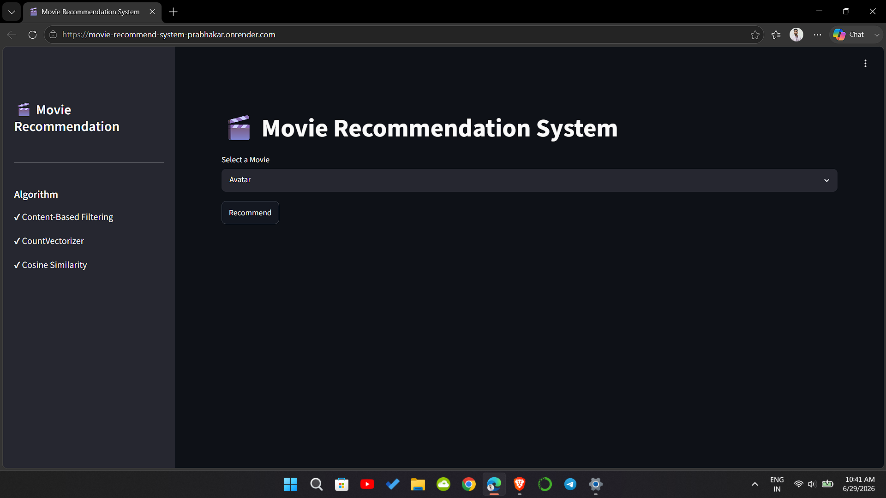

# 🎬 Movie Recommendation System

<p align="center">


</p>

A **Content-Based Movie Recommendation System** built using **Machine Learning**, **Natural Language Processing (NLP)**, and **Streamlit**. The application recommends movies based on content similarity using **CountVectorizer** and **Cosine Similarity**, while displaying movie posters using the **OMDb API**.

---

# 🚀 Live Demo

🌐 **Render Deployment**

https://movie-recommend-system-prabhakar.onrender.com/

---

# 💻 GitHub Repository

https://github.com/Prabhakar620126/movie-recommendation-system

---

# 📸 Screenshots

## Home Page



---

## Recommendation Result


---

## Render Deployment


---

# ✨ Features

- 🎬 Content-Based Movie Recommendation
- 🔍 Search movies using an interactive dropdown
- 🖼️ Movie poster integration using OMDb API
- 📊 Cosine Similarity based recommendations
- ⚡ Fast recommendation generation
- 🌐 Live deployment on Render
- 📱 Responsive Streamlit UI
- 🎯 Top 5 similar movie recommendations

---

# 🧠 Machine Learning Pipeline

```text
Movie Dataset
      │
      ▼
Data Cleaning
      │
      ▼
Feature Engineering
      │
      ▼
Create Tags
(Overview + Genres + Keywords + Cast + Director)
      │
      ▼
CountVectorizer
(max_features=5000)
      │
      ▼
Feature Vectors (vectorizer.pkl)
      │
      ▼
Cosine Similarity
(Computed Dynamically)
      │
      ▼
Recommend Top 5 Movies
```

# 📊 Dataset

- TMDB 5000 Movie Dataset

Features used:

- Movie Title
- Overview
- Genres
- Keywords
- Top 3 Cast Members
- Director

These features were combined into a single **tag** column before vectorization.

---

# 🤖 Recommendation Algorithm

This project uses **Content-Based Filtering**.

Movies are recommended based on:

- Overview
- Genres
- Keywords
- Cast
- Director

The recommendation engine uses **CountVectorizer** to convert movie tags into numerical vectors and **Cosine Similarity** to find the five most similar movies.

---

# 🛠️ Tech Stack

- Python
- Pandas
- NumPy
- Scikit-Learn
- Streamlit
- Requests
- OMDb API
- Git
- GitHub
- Render

---

# 📁 Project Structure

```text
movie-recommendation-system/

│
├── app.py
├── movie.pkl
├── vector.pkl
├── requirements.txt
├── README.md
├── .gitignore
└── screenshots/
    ├── home.png
    ├── recommendation.png
    └── render.png
```

---

# ⚠️ Why is `similarity.pkl` not included?

GitHub does not allow files larger than **100 MB**.

The generated `similarity.pkl` file was approximately **185 MB**, so it could not be uploaded.

Instead:

- `vectorized.pkl` is stored in the repository.
- Cosine Similarity is calculated dynamically inside `app.py`.

This reduces repository size while maintaining the same recommendation quality.

---

# ⚙️ Installation

Clone the repository:

```bash
git clone https://github.com/Prabhakar620126/movie-recommendation-system.git
```

Go to the project directory:

```bash
cd movie-recommendation-system
```

Create a virtual environment:

```bash
python -m venv .venv
```

Activate the virtual environment (Windows):

```powershell
& .\.venv\Scripts\Activate.ps1
```

Install dependencies:

```bash
pip install -r requirements.txt
```

Run the application:

```bash
streamlit run app.py
```

---


# 🌍 Deployment

**Render**

https://movie-recommend-system-prabhakar.onrender.com/

---

# 📈 Future Improvements

- Hybrid Recommendation System
- Collaborative Filtering
- User Login
- Watchlist
- Trailer Integration
- Genre Filtering
- Fuzzy Search
- Latest Movie Dataset

---

# 👨‍💻 Author

**Prabhakar Kumar Shahi**

🎓 B.Tech – Information Technology

💼 Aspiring Data Scientist | Machine Learning Engineer

**GitHub**

https://github.com/Prabhakar620126

**LinkedIn**

https://www.linkedin.com/in/prabhakar-kumar-shahi-b84851259/

---

# ⭐ Support

If you found this project helpful, please give it a ⭐ on GitHub.
